# Design

## Application Flow Diagram

The following diagram shows the complete application flow of the Threat Modeling VS Code extension:

```mermaid
graph TD
    %% User Interaction Layer
    VSCode --> Chat[Copilot Chat Interface]
    
    %% Extension Activation
    Chat -->|"@threatmodel start modeling"| ChatParticipant[chatParticipant.ts]
    VSCode -->|Extension Activation| Extension[extension.ts]
    Extension --> ParticipantReg[Register Chat Participant]
    ParticipantReg --> CommandReg[Register Commands]
    
    %% Chat Request Handler
    ChatParticipant -->|handleChatRequest| StateManager[ConversationState.ts]
    StateManager -->|getState/setState| StateStorage[(Conversation State Storage)]
    
    %% Threat Modeler Detection & Selection
    ChatParticipant --> FileUtils[utils/fileUtils.ts]
    FileUtils -->|detectThreatModeler| WorkspaceFiles[Workspace File Scan]
    WorkspaceFiles -->|Find .tf files| TerraformDetected{Terraform Files Found?}
    
    TerraformDetected -->|Yes| TerraformModeler[TerraformThreatModeler.ts]
    TerraformDetected -->|No| NoSupport[No Supported Files Error]
    
    %% Terraform Analysis Workflow
    TerraformModeler -->|analyzeThreats| TerraformWorkflow[TerraformWorkflow Class]
    TerraformWorkflow -->|Phase 1: Raw Discovery| RawAssetDiscovery[identifyAssets]
    TerraformWorkflow -->|Phase 1: Relationship Mapping| RawRelationshipMapping[mapRelationships]
    
    %% HCL Processing
    RawAssetDiscovery -->|Parse .tf files| HCLParser[hcl-to-json Library]
    HCLParser -->|Convert HCL to JSON| HCLJson[(Parsed HCL JSON)]
    HCLJson -->|Extract Resources| RawAssets[Raw Terraform Assets]
    
    RawRelationshipMapping -->|Parse Dependencies| DependencyExtraction[Extract depends_on & references]
    DependencyExtraction -->|Map Asset Relationships| RawGraph[Raw Asset Graph]
    
    %% Consolidation Phase
    RawAssets -->|Phase 2: Consolidation| ArchitecturalAnalysis[performArchitecturalAnalysis]
    RawGraph -->|Phase 2: Consolidation| RelationshipConsolidation[consolidateRelationships]
    
    ArchitecturalAnalysis -->|Try Terraform CLI| TerraformGraphAttempt{Terraform Graph Available?}
    TerraformGraphAttempt -->|Yes| GraphBasedAnalysis[analyzeGraphArchitecture]
    TerraformGraphAttempt -->|No| LLMBasedAnalysis[createHighLevelArchitecturalComponents]
    
    GraphBasedAnalysis -->|Parse DOT Graph| ClusterExtraction[extractArchitecturalClustersFromGraph]
    LLMBasedAnalysis -->|Group by Architecture| ArchitecturalGrouping[determineHighLevelArchitecture]
    
    ClusterExtraction -->|Create Consolidated Assets| ConsolidatedAssets[8-12 Architectural Systems]
    ArchitecturalGrouping -->|Create Consolidated Assets| ConsolidatedAssets
    
    RelationshipConsolidation -->|Filter Valid Relationships| ConsolidatedGraph[Consolidated Asset Graph]
    
    %% Threat Analysis Prompt Generation
    ConsolidatedAssets -->|Generate Analysis Context| ThreatPromptGen[generateThreatAnalysisPrompt]
    ConsolidatedGraph -->|Include Relationship Data| ThreatPromptGen
    ThreatPromptGen -->|Create Structured Prompt| StructuredPrompt[Infrastructure Security Analysis Prompt]
    
    %% LLM Integration
    StructuredPrompt -->|Send to GitHub Copilot| VSCodeLM[vscode.lm API]
    VSCodeLM -->|selectChatModels| CopilotModels[Available Copilot Models]
    CopilotModels -->|Use First Available| ModelRequest[model.sendRequest]
    ModelRequest -->|Stream Response| ThreatAnalysisResult[STRIDE Threat Analysis]
    
    %% Response Streaming
    ThreatAnalysisResult -->|Stream to Chat| ResponseStream[vscode.ChatResponseStream]
    ResponseStream -->|Display Results| ChatOutput[Chat Response with:]
    
    %% Output Components
    ChatOutput --> ArchOverview[🏗️ Architectural Overview]
    ChatOutput --> AssetInventory[📋 Asset Inventory] 
    ChatOutput --> MermaidDiagram[📊 Mermaid Architecture Diagram]
    ChatOutput --> StrideAnalysis[🛡️ STRIDE Threat Analysis]
    ChatOutput --> Mitigations[🔧 Mitigation Recommendations]
    
    %% Error Handling Paths
    VSCodeLM -->|LM Unavailable| FallbackPrompt[Manual Copilot Chat Prompt]
    HCLParser -->|Parse Error| FallbackAssets[Dummy Assets]
    DependencyExtraction -->|Parse Error| FallbackRelationships[Dummy Relationships]
    
    %% Refinement Flow
    ChatOutput -->|User Refinement Request| RefinementHandler[Handle Refinement]
    RefinementHandler -->|Modify Base Prompt| RefinedPrompt[Refinement Prompt]
    RefinedPrompt -->|Send to LM| ModelRequest
    
    %% State Persistence
    ConsolidatedAssets -->|Store Analysis| StateStorage
    ConsolidatedGraph -->|Store Analysis| StateStorage
    
    %% Architecture Types
    subgraph ArchTypes [Architecture Classification]
        Frontend[Frontend & API Layer]
        Application[Application Layer] 
        Database[Database Layer]
        Storage[Storage Layer]
        Security[Security & Identity]
        Network[Network Infrastructure]
        Monitoring[Monitoring & Operations]
        Supporting[Supporting Infrastructure]
    end
    
    ArchitecturalGrouping --> ArchTypes
    
    %% Output Format Types  
    subgraph OutputFormats [Structured Report Format]
        KeyFeatures[Infrastructure Key Features]
        ArchDiagram[Architecture Diagram]
        AssetList[Protected Assets]
        ThreatList[STRIDE Threat Catalog]
        MitigationList[Mitigation Strategies]
    end
    
    StructuredPrompt --> OutputFormats
    
    %% Type Definitions Layer
    subgraph TypeDefs [Type Definitions]
        ThreatAsset[ThreatAsset Interface]
        AssetGraph[AssetGraph Interface] 
        Threat[Threat Interface]
        ThreatValidation[ThreatValidation Interface]
        ThreatMitigation[ThreatMitigation Interface]
    end
    
    RawAssets -.->|implements| ThreatAsset
    ConsolidatedGraph -.->|implements| AssetGraph
    ThreatAnalysisResult -.->|implements| Threat
    
    %% Styling
    classDef userLayer fill:#e1f5fe
    classDef extensionLayer fill:#f3e5f5  
    classDef analysisLayer fill:#e8f5e8
    classDef llmLayer fill:#fff3e0
    classDef outputLayer fill:#fce4ec
    
    class User,VSCode,Chat userLayer
    class Extension,ChatParticipant,FileUtils,StateManager extensionLayer
    class TerraformModeler,TerraformWorkflow,ArchitecturalAnalysis,ConsolidatedAssets analysisLayer
    class VSCodeLM,CopilotModels,ModelRequest,ThreatAnalysisResult llmLayer
    class ResponseStream,ChatOutput,ArchOverview,StrideAnalysis outputLayer
```

### Key Application Flow Components

#### 1. **Extension Lifecycle**
- `extension.ts` activates on chat participant events
- Registers chat participant and command handlers
- Sets up VS Code API integration points

#### 2. **Chat Request Processing** 
- `chatParticipant.ts` handles `@threatmodel start modeling` commands
- `ConversationState.ts` manages multi-turn conversation state
- Supports refinement requests and follow-up analysis

#### 3. **Threat Modeler Detection**
- `fileUtils.ts` scans workspace for supported file types
- Currently supports Terraform (`.tf` files) detection
- Extensible architecture for future IaC support (CloudFormation, etc.)

#### 4. **Terraform Analysis Pipeline**
- **Phase 1 (Raw Discovery)**: `hcl-to-json` parses `.tf` files, extracts resources and dependencies
- **Phase 2 (Consolidation)**: Groups 200+ resources into 8-12 architectural systems
- **Graph Analysis**: Attempts Terraform CLI graph, falls back to pattern-based grouping

#### 5. **LLM Integration**
- Uses `vscode.lm` API to access GitHub Copilot models
- Generates structured threat modeling prompts
- Streams real-time threat analysis responses

#### 6. **Output Generation**
- Produces structured threat modeling reports
- Includes Mermaid architecture diagrams
- Follows STRIDE framework categorization
- Provides concrete mitigation recommendations

## References

### Threat Modeling Report Structure
https://www.nccgroup.com/research-blog/threat-modelling-cloud-platform-services-by-example-google-cloud-storage/
